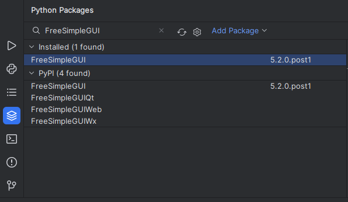
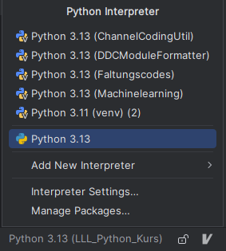

## Bibliothek für Benutzeroberflächen

### Wichtig

Um `PySimpleGUI` zu nutzen, muss man sich seit einiger Zeit in der Bibliothek anmelden.\
Weil das kacke ist, nutzen wir die Bibliothek `FreeSimpleGUI`, welche exakt identisch
zu PySimpleGUI funktioniert.

### Installation in PyCharm

*Installierst du das Package nur in PyCharm, wirst du es nicht außerhalb von PyCharm nutzen können.*
Wenn du also deine Programme auch ohne PyCharm öffnen können willst, befolge die Anleitung
weiter unten.

Wenn alles gut läuft, kannst du die Bibliothek in Pycharm einfach über den Tab
`Python Packages` installieren:\


*Aber*

bei mir funktioniert es nicht.

Probier es bei dir aus, vielleicht hast du Glück:\
Nachdem du FreeSimpleGUI installiert hast (Sieht dann ähnlich aus wie auf dem Bild),
öffne ein neues Skript und schreibe folgendes rein:
```py
import FreeSimpleGUI
```
Lässt sich das Skript ohne Fehler ausführen, alles gut.
Wenn nicht, befolge den nächsten Abschnitt.

### Lösung des Fehlers

Ich habe es nicht geschafft den Fehler zu lösen, aber kann ihn umgehen.

PyCharm erzeugt für jedes Projekt ein sogenanntes virtual enviroment (venv).
Dies kannst du dir wie eine komplett unabhängige Python Installation vorstellen.
Fügst du dort Bibliotheken ein, sind diese nur im venv des Projekt, sonst nirgendswo.

Statt des venv lässt sich aber auch die auf dem ganzen Computer installierte Python-Version nutzen.
In 99.9% aller Fälle hast du keinen Nachteil davon.

Klicke dazu auf dein enviroment ganz unten rechts im Fenster und wähle die Python-Version ohne
Projektzuordnung aus:\


Versuche jetzt erneut, die Bibliothek zu installieren und zu starten.

### PySimpleGUI ohne PyCharm installieren

*Hast du den vorherigen Abschnitt befolgt (Fehlerbehebung), ist es bereits außerhalb von
PyCharm installiert. Dann brauchst du diesen Schritt nicht.*

Öffne die Eingabeaufforderung (cmd), indem du `cmd` in deine Windows-Suche eingibst und enter drückst.
Gib in das neu geöffnete Fenster folgendes ein:
```commandline
pip install FreeSimpleGUI
```

Fertig!


