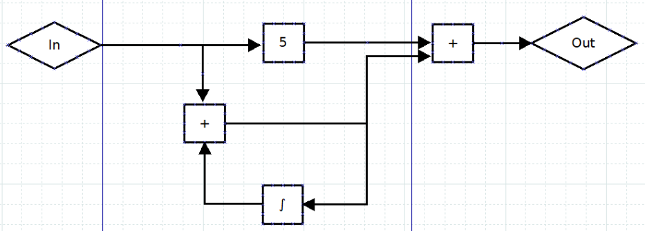

## Zusatzübung 11: OOP

In der Signalverarbeitung werden Systeme oft als Flussdiagramm dargestellt:

Dabei wird ein Eingangssignal `In` in ein Ausgangssignal `Out` überführt.
In dieser Übung implementieren wir ein “Framework”, also die Grundlage, um solche Systeme zu simulieren. Eine Zahl im Block bedeutet Multiplikation mit dieser Zahl.

Die einzelnen Funktionen werden als Blöcke dargestellt. 
Das Signal geht in den Block rein, wird dort verarbeitet und geht aus dem Block wieder raus. 
Jeder Block hat dabei eine einfach zu implementierende Funktionalität. 
Steht also erstmal das Grundgerüst, ist es einfach, neue Blöcke zu erstellen.

1. Erstelle die globalen Variablen tick und dt.\
tick speichert den aktuellen Zeitschritt.\
dt ist eine Konstante, welche aussagt, wie viele Sekunden Simulation pro tick vergehen.
2. Erstelle die Klasse Block. Diese Klasse dient als Vorlage für alle verschiedenen Blöcke, welche eine eigene Klasse bekommen.\
   1. In die `__init__` werden alle Blöcke übergeben, welche auf den erstellten Block zeigen. In dem Beispiel oben wird an den rechten + Block also der linke + Block und der “5”-Block übergeben. Die übergebenen Blöcke werden im Block abgespeichert.
   2. Die `__init__` soll außerdem drei optionale Argumente annehmen: `p1`, `p2` und `p3`. Diese werden auch in dem Block gespeichert.
   3. Füge die Methode `getAusgang()` hinzu. Diese Methode soll erstmal nichts machen, sondern wird später von den erbenden Klassen verwendet.
   4. Füge die Methode `__call__()` hinzu. 
   Diese Methode gibt die Rückgabe von `getAusgang()` zurück.
   5. Dabei verhindert sie, dass `getAusgang()` mehrfach pro Tick aufgerufen wird. 
   Beim erneuten Aufruf der Methode soll der zuvor zurückgegebene Wert nochmal zurückgegeben werden.  
   Warum ist das wichtig? Tipp: Guck dir das Bild oben genauer an.
   6. Jeder Block soll speichern, ob mindestens ein Block dessen Ergebnis benutzt. Im Beispiel trifft das auf jeden Block außer “Out” zu.
   7. Alle erstellten Blöcke sollen in einer globalen Liste abgelegt werden.
   8. Füge die Methode `addBlocke(*dieBlocke)->None` hinzu, mit welcher sich Blöcke auch nach Aufruf der `__init__` als Eingang hinzufügen lassen.

Hast du alles richtig gemacht, kannst du jetzt für jeden Block-Typen eine erbende Klasse erstellen und musst meistens ausschließlich `getAusgang()` anpassen.

Implementiere die folgenden Blöcke. Nicht benötigte Eingänge werden ignoriert.

3. `Mal`: Multipliziert den Eingang mit p1.
4. `Add`: Addiert alle Eingänge.
5. `K`: Gibt die Konstante p1 aus.
6. `PrintInline`: Gibt den Eingangswert an den Ausgang weiter und gibt ihn auf der Konsole aus.
7. `Diff`: Berechnet die Ableitung des Eingangssignals mit dieser Formel: `Out = (inJetzt - inVorher) / dt`
8. `Integ`: Berechnet das Integral des Eingangssignals mit dieser Formel: `Out = outVorher + inJetzt * dt`
10. `Stufe`: Bis tick `p3` erreicht hat, gibt es `p1` aus, danach `p2`.
11. `Plot`: Gibt den Eingangswert an den Ausgang weiter. Wird tick `p1` erreicht, plottet der Block alle bisherigen Werte. Die x-Achse geht dabei von `0` bis `p1 * dt`.
    1. `Optional`: Bonuspunkte für dich, wenn du die Werte in einem Numpy-Array speicherst.

Nun widmen wir uns dem Ablauf.
Hast du alles richtig implementiert, rufen sich die Blöcke gegenseitig auf, von “hinten” nach “vorne”. 
Die Berechnung muss also an allen Blöcken gestartet werden, deren Ausgang nicht genutzt werden. 
Glücklicherweise hast du ja bereits eine Abfrage erstellt um zu gucken, ob der Ausgang eines Blocks genutzt wird.

12. Lege alle Blöcke, deren Ausgang nicht genutzt wird in einer extra Liste ab.
13. Erstelle eine Schleife für den Ablauf. Bei jedem Durchgang der Schleife wird tick um 1 erhöht und in allen zuvor ermittelten Blöcken wird .__call__() aufgerufen.

Damit bist du fertig.

14. Baue das Beispiel aus dem Bild in deinem Skript nach. Nutze als Eingang eine Stufe, die bei Tick 50 von 0 auf 1 wechselt. Nutze einen Plot als Ausgang, der bei Tick 300 angezeigt wird. Setze dt auf 0.01.

