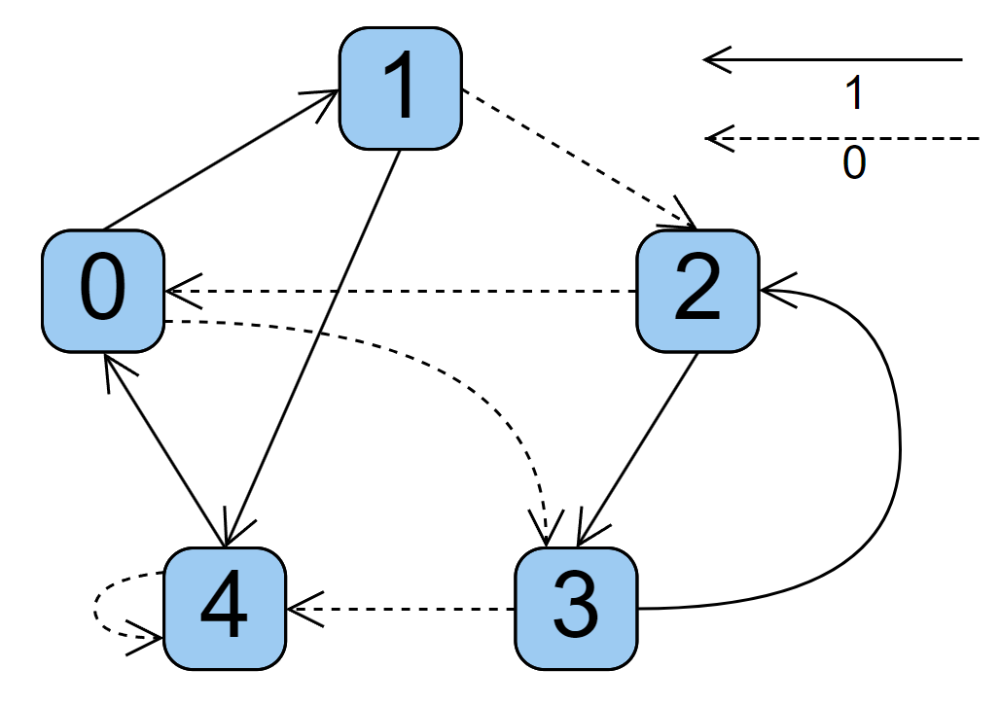

## Zusatzübung 14: Grundlagen

In dieser Übung implementieren ein Verhalten nach folgendem (Moore-)Zustandsautomaten:



Der Automat hat einen Eingang und einen Zustand (Für die Informatiker: Ausgang ist gleich dem Zustand).
Am Eingang liegt bei jedem Schritt entweder 0 oder 1 an.
Dadurch wird entschieden, in welchem Zustand sich der Automat als nächstes befindet.

Der Automat befindet sich zu Beginn in Zustand 0.

Beispiel:
- Der Automat befindet sich zu Beginn in Zustand 0
- Es wird eine 0 eingegeben: Der Automat wechselt in Zustand 3.
- Es wird wieder 0 eingegeben: Der Automat wechselt in Zustand 4.
- Wieder 0: Der Automat bleibt in Zustand 4.
- 1: Wechsel in Zustand 0
- 1: Welchsel in Zustand 1

Demnach ist die Zustandsfolge (0-)3-4-4-0-1

```pycon
eingabe = [0,1,0,0,0,1,0,0,1,1,1,0,1,0,1,0,0,0,1,1,0,1,1,1,1,1,0,1,0,0,0] # Nur für Teil 1 relevant
zustande = [0,1,2,3,4,4,4,0,3,4,0,1,2,3,2,3,2,0,3,2,3,4,0,1,4,4,0,1,2,0,3] # Nur für Teil 2 relevant
```

Hinweis: Deine Lösung soll für beliebige Eingaben funktionieren, nicht nur für genau diese!\
Tipp: Überlege dir vorm Programmieren erstmal einen ungefähren "Schlachtplan".
Also wie möchtest du die Aufgabe lösen?
Einfach drauf los zu programmieren kann manchmal helfen, in diesem Fall aber vermutlich nicht.

1. Gib auf der Konsole die zur Eingabe gehörige Zustandsfolge aus.
Tipp: Das lässt sich komplett ohne if-Verzweigung implementieren.\
Lösung: `0 - 3 - 2 - 0 - 3 - 4 - 0 - 3 - 4 - 0 - 1 - 4 - 4 - 0 - 3 - 2 - 0 - 3 - 4 - 0 - 1 - 2 - 3 - 2 - 3 - 2 - 3 - 4 - 0 - 3 - 4 - 4`
2. Gib auf der Konsole die zur Zustandsfolge gehörige Eingabe aus.\
Lösung: `1 - 0 - 0 - 0 - 1 - 0 - 0 - 1 - 0 - 0 - 0 - 1 - 0 - 1 - 0 - 0 - 0 - 1 - 0 - 0 - 1 - 0 - 0 - 0 - 0 - 0 - 1 - 0 - 0 - 0 - ?`
   1. Optional: Nutze maximal eine if-Verzweigung.
   2. Optional: Nutze gar keine if-Verzweigung (hab keine elegante Lösung dazu gefunden, bin gespannt was ihr so macht)
3. Nach den Ausgaben aus 1. und 2. soll der Nutzer weitere Eingaben auf der Konsole machen können (0 oder 1).
Ausgegegen wird der jeweils nächste Zustand. Setze den Zustand vorher auf 0 zurück.
   1. Gibt der Nutzer nichts ein, soll das Skript beendet werden.
   2. Gibt der Nutzer etwas Anderes ein als 0 oder 1, soll die Eingabe ignoriert werden.
   3. Gibt der Nutzer mehrere Zeichen (z.B. `01110010`) ein, sollen diese der Reihe nach verarbeitet werden.
