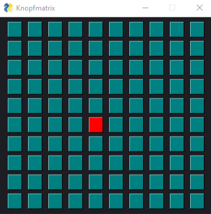

## Übung 14.1

In dieser Übung erstellen wir einen “Taschenrechner”.

1. Erstelle das Grundkonstrukt, wie man es bei PySimpleGUI immer macht.
2. Füge 3 inputs hinzu. 2 davon sollen als Eingabe und 1 als Ausgabe dienen. Denk dran, die keys vernünftig zu definieren.
3. Setze bei der Ausgabe das Argument disabled auf True, damit man dort nichts eingeben kann.
4. Füge 4 Knöpfe hinzu, für plus, minus, mal und geteilt.
5. Wird einer der Knöpfe gedrückt, werden die Eingaben entsprechend verrechnet und das Ergebnis wird in der Ausgabe gezeigt.
6. Sicher das Programm mit Try…Except ab, sodass es nicht abstürzt, wenn man Quatsch eingibt.

## Übung 14.2 

Diese Namensliste kennst du ja bereits: `Materialien/Namenliste.txt`
Bitte einmal runterladen und in deinen Skriptordner tun.

Erstelle ein Skript, mit welchem sich die Namenliste durchsuchen lässt.
Es soll ein `Input` und eine `Table` enthalten.

Im `Input` wird der Suchtext eingegeben, im `Table` werden alle Namen aufgelistet, welche den Suchtext enthalten.
Die Namen müssen nicht nach Vor- und Nachname aufgeteilt werden. Gerne beides in ein Feld.

Tipp: Mach nicht alles auf einmal. 
Überlege dir, was dein Programm alles können muss (z.B. Datei auslesen). 
Implementiere es in kleinen Stücken und setze dann das Programm zusammen. 
Schreibe eigene Funktionen, wenn es sich anbietet!

## Übung 14.3 

Erstelle die Funktion `passwortabfrage(dasPasswort:str)->bool`.

Wird die Funktion aufgerufen, öffnet sich ein Fenster mit einem `Input`, einem `Button ` und einem `Text`.

Die Rückgabe der Funktion (`bool`) gibt an, ob sich der Nutzer korrekt eingeloggt hat oder nicht.

1. Der Nutzer muss im `Input` das Passwort eingeben und mit dem `Button` bestätigen. 
Ist das Passwort richtig, wird `True` zurückgegeben.
2. Damit das Passwort nicht angezeigt wird, setze das Argument `password_char` des Inputs auf `*`.
3. Der Nutzer hat 3 Versuche. Die Anzahl verbleibender Versuche wird im Text angezeigt. Sind keine Versuche mehr da, wird False zurückgegeben.
4. Wird das Fenster geschlossen, wird False zurückgegeben.
5. Wird im Passwort-Feld `Enter` gedrückt, wird die Eingabe bestätigt, genau wie mit dem Button.

## Übung 14.4 

Erstelle ein Fenster mit 100 Knöpfen, die quadratisch angeordnet sind (siehe Bild).\
Wird der Mauszeiger auf einen Knopf gehalten (nicht geklickt, nur drüber gehalten!), soll dieser rot gefärbt werden.

## Übung 14.5 

1. Erstelle folgendes layout:\
\
(Das Theme ist DarkBrown)

2. Erweitere das Layout um ein sg.Multiline:\

3. Erstelle zwei Tabs. Ein Tab soll dein bisheriges Layout enthalten:\

4. Der andere Tab soll 12 Frames mit dem Layout aus 1. enthalten.\
Tipp: Denk dran, dass man meistens eine Funktion schreiben sollte, wenn man Code kopieren möchte.\

