## Übung 17.1

Erzeuge folgende np.arrays mit möglichst geringem Aufwand.
Schau gut hin, damit du keine Zahlen übersiehst.
Nutze keine Schleifen und keine Numpy-Funktionen, die wir noch nicht besprochen haben.

1. 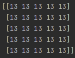
2. 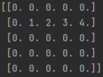
3. 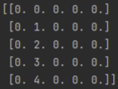
4. 
5. 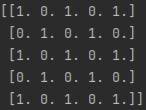
6. 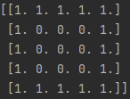
7. 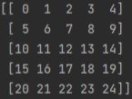
8. 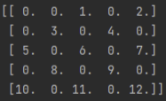
9. 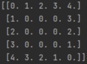

## Übung 17.2

Plotte folgende Funktionen jeweils von -10 bis 10:

1. $x²$
2. $3x³ - 2x² + 1$
3. $e-xsin(2pi x)$

Plotte folgende Funktionen in ein gemeinsames Diagramm (Bereich wieder -10 bis 10):

4. $sin(x)$
5. $sin(2x)$
6. $sin(x + 0.5pi)$
7. $(sin(x))²$

## Übung 17.3

Alle nachfolgenden Plots sollen in beiden Achsen von -10 bis 10 groß sein.
Steht nichts zwischen zwei Termen, heißt das “mal”. xy bedeutet also x mal y.

1. Der Radius r, also die Entfernung vom Ursprung (0,0) berechnet sich so: $r=\sqrt{x²+y²}$ (Auch für folgende Teile wichtig.)
Plotte diese Funktion in einem pcolor-Plot.
   1. Lege ein contour-Plot drauf, damit man den Verlauf besser erkennen kann:\
   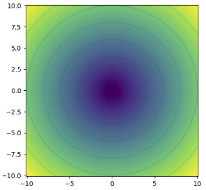
2. Plotte folgende Funktion in pcolor: $f(x,y) = r sin(x)cos(y)$
3. Plotte folgendes Vektorfeld als streamplot:
$\binom{y * (0.5r - 4)}{x * (r + 1)}$\
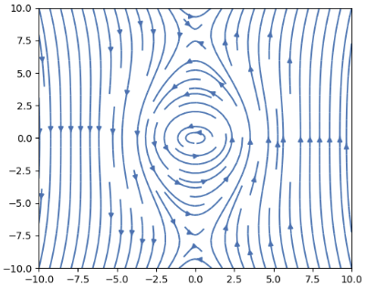
4. (Nur ab Oberstufe) Erstelle einen quiver-Plot, in welchem alle Pfeile auf den Punkt (5,5) zeigen. 
Die Länge der Pfeile ist egal.\
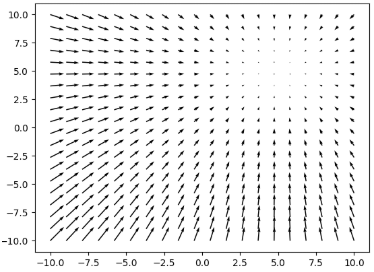

## Übung 17.4

Erzeuge folgende Plots. 
Die Plots müssen nicht exakt gleich sein. 
Keine Schleifen benutzen.

1. scatter-Plot\
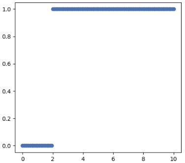
2. Den Balken erzeugt man mit plt.colorbar() direkt nach plt.pcolor(...)\
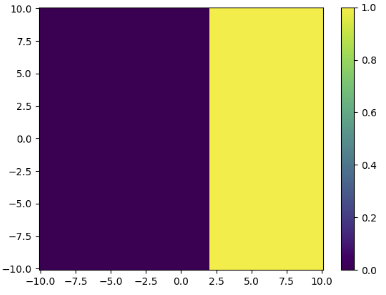
3. 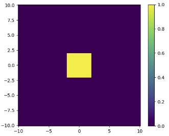
4. Verwendete Funktionen: x² und 2x. Tipp: Erzeuge erstmal nur eine Folge von 0 und 1\
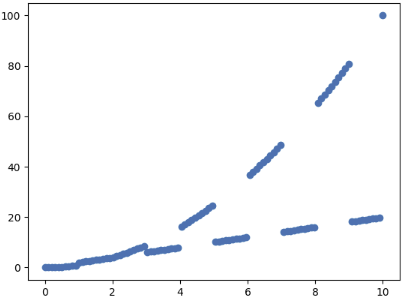

## Übung 17.5

Das elektrische Potential einer positiv geladenen Kugel mit einem Radius von 1 kann unter Umständen durch folgende 
Funktionen beschrieben werden:\
Innerhalb der Kugel:    $\frac{1}{2} - \frac{r²}{6}$\
Außerhalb der Kugel:	$\frac{1}{3r}$\
Der Radius r berechnet sich so: $r = \sqrt{x² + y²}$

1. Plotte das Potential der Situation in einem pcolor-Plot\

2. Plotte das Potential entlang der X-Achse (Also für y = 0) in einem normalen Plot.\
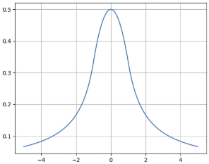

Befinden sich mehrere dieser Ladungs-Kugeln im Raum, addieren sich deren Potentiale. 
Liegt die Kugel nicht in der Mitte des Koordinatensystems, musst du den Radius des zugehörigen Potentials 
so berechnen: $r = \sqrt{ (x - x_{Kugel})² + (y - y_{Kugel})² }$

3. Schreibe die Funktion `getPotential(posX:float, posY:float)->np.ndarray`.
Diese gibt das Potential, also das, was in 1. geplottet wurde, zurück.\
Übergeben wird die Position der Kugel.\
**Diesen Schritt nicht überspringen:** Teste die Funktion, indem du die Berechnung aus 1. mit der Funktion ersetzt.
4. Statt einer einzigen mittigen Kugel gibt es jetzt 3 Kugeln mit folgenden Koordinaten:
(3,0), (-3,2), (0,-2)\
Plotte die neue Situation, indem du deine erstellte Funktion nutzt.\
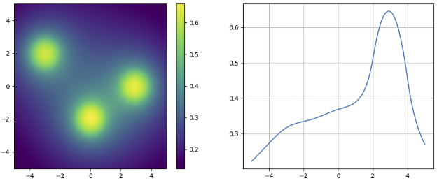

## Übung 17.6

Schreibe folgendes Programm:

Der Nutzer gibt sein Geburtsdatum ein, z.B. so: `15.08.2004`

1. Das Programm gibt aus, ob der Nutzer dieses Jahr bereits Geburtstag hatte, oder ob er heute Geburtstag hat.
2. Das Programm gibt aus, wie viele Tage der vorherige Geburtstag her ist und wie viele Tage es bis zum nächsten Geburtstag sind.
3. Das Programm gibt aus, wie alt der Nutzer ist. Ab dem Geburtstag ist man ein Jahr älter.
Teste das mit einem Geburtstag, der gestern war und einem Geburtstag, der morgen ist.
4. Wurde eine fehlerhafte Eingabe getätigt, wird ein Fehler ausgegeben und der Nutzer soll seine Eingabe wiederholen.
5. Das Programm entscheidet von sich aus, in welchem Format das Geburtsdatum eingegeben wurde. Wird kein Jahr angegeben, wird kein Alter zurückgegeben.
Diese Eingaben sollen alle möglich sein:\
15.08.\
15.08.04\
15-08-2004\
2004-08-15\
15 Aug 2004

## Übung 17.7

Du hast 100 Würfel, die du alle gleichzeitig würfelst. Danach bildest du die Summe aller gewürfelten Zahlen.

1. Simuliere dieses Experiment 100, 1’000 und 10’000 Mal.
Nutze keine Schleifen.
2. Plotte die Ergebnisse in einem normalen plt.plot.
3. Plotte die Ergebnisse in einem Histogramm. Nutze 300 bins.

## Übung 17.8

(Sehr stark vereinfachter Sonderfall)
Wenn Computer untereinander kommunizieren, senden sie sich gegenseitig binäre Signale, 
entweder 1, oder -1. 
Diese Signale müssen durch einen Kanal, der beide Computer miteinander verbindet, zum Beispiel ein Kabel.

Kanäle “rauschen”, was bedeutet, gesendete Signale werden je nach Kanal zufällig verfälscht. 
Statt einer 1, könnte also z.B. 1.25 ankommen.
Der Empfänger interpretiert alle Zahlen größer 0 als 1 und alle Zahlen kleiner 0 als -1.

Manchmal kommt es vor, dass ein Wert durch Rauschen so stark verändert wird, dass der Empfänger ihn falsch interpretiert. 
Wird beispielsweise -1 gesendet, aber 0.3 empfangen, interpretiert der Empfänger den Wert falsch. 
Man redet von einem Bitfehler:\
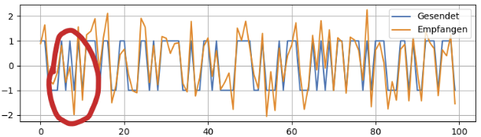

In dieser Übung untersuchen wir dieses Verhalten.
1. Erstelle ein Array mit 10000 zufälligen Bits, entweder -1, oder 1. 
Dieses Array wird in unserer Simulation “gesendet”.
2. Plotte ein Histogramm des Arrays. Erhöhe die Anzahl an Balken auf 100.
3. Verrausche das Signal, indem du zufällige Werte darauf addierst. 
Die zufälligen Werte entsprechen einer Normalverteilung mit einer Standardabweichung von 0.4.
4. Plotte auch davon ein Histogramm.
5. Erstelle ein Array, welches beinhaltet, wie der Empfänger diese Werte interpretiert. 
Werte größer 0 werden zu 1, Werte kleiner 0 zu -1. Gleich 0 kannste dir aussuchen.
6. Bestimme, wie viele Bits falsch interpretiert wurden. Printe den Wert mit entsprechender Nachricht.
7. Eigentlich interessiert uns, wie viel Prozent der Bits falsch übertragen wurden. 
Gib den prozentualen Wert aus:\
`100 * AnzahlFehler / AnzahlBitsGesamt`
8. Erhöhe die Standardabweichung auf 0.6 und führe das Experiment erneut durch.

Um die Chance auf Bitfehler gering zu halten, wird der gleiche Wert jetzt 7 Mal hintereinander gesendet und empfangen. 
Also für jedes Bit werden tatsächlich 7 Bits gesendet.\
Wurde in der 7er Folge häufiger 1 empfangen als -1, wird die gesamte Folge als 1 interpretiert, sonst als -1.

9. Implementiere diese Verbesserung. Warum werden 7 statt 8 Samples genutzt?
   1. Optional: Nutze keine Schleifen und lass trotzdem die Möglichkeit, die 7 ohne Aufwand in eine andere Zahl zu ändern.
   Tipp: Denk an die Funktionsweise von `np.meshgrid`

